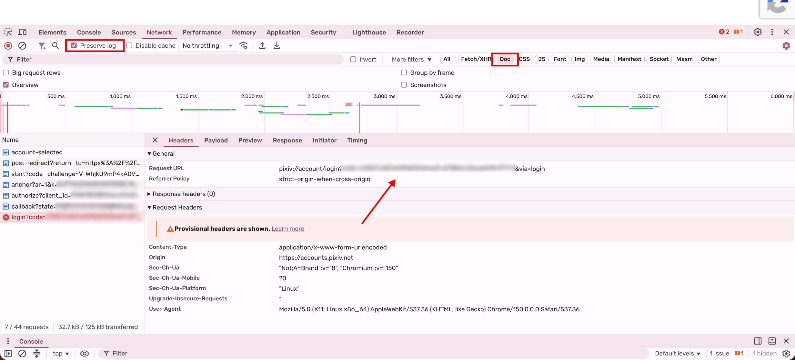
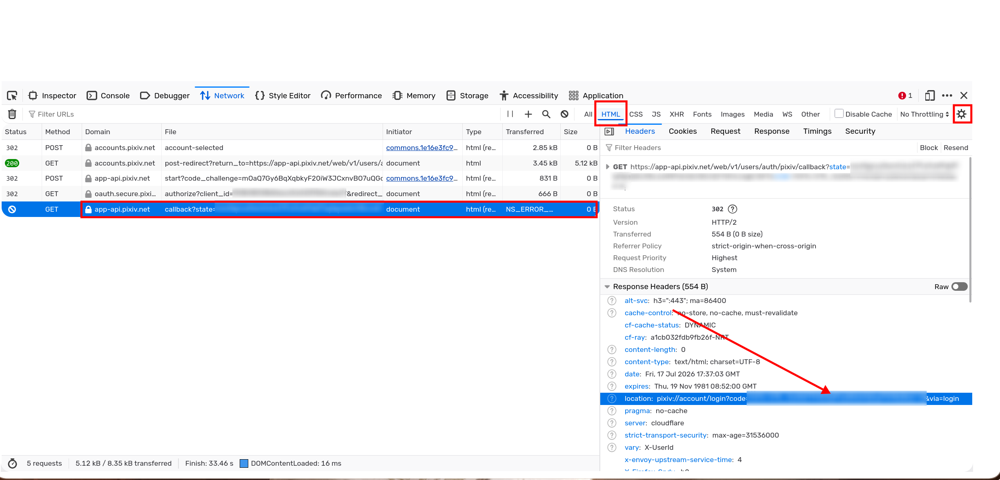

这个项目起于我心血来潮（~~闲的没事干~~）从上游 [pxder](https://github.com/Tsuk1ko/pxder) ts 重写而来，修复了一些 bug (?)。

目前需要手动在终端中导入代理，开 tun 是最方便的，~~有时间我完善一下~~

## 安装

### 从 release 下载

点击 github 界面右边的 release 选择对应系统的二进制文件下载即可。

### 从 github 拉取

需要安装依赖 nodejs，npm，pnpm 和 typescript。pnpm 的下载方式请参考[文档](https://pnpm.io/installation)，装好 pnpm 后从 github clone 后在根目录 `pnpm install typescript` 后 `pnpm exec tsc` 生成构建产物 `dist` 文件夹。运行 `node ./dist/src/iroha.js` 即可。

个人推荐手动从浏览器获取 refresh token 或者使用其他工具获取 (比如 [gppt](https://github.com/eggplants/get-pixivpy-token))。

## 登录方式

- 在 shell 中输入 `iroha --login` 后，手动复制链接到浏览器中。
- 在设置中或按 f12 打开开发者工具，在 Network 里勾选 preserve log 进行登录（如果是 firefox 则在右上的设置图标中勾选 persist logs），如下图。
- 登录后勾选 Doc 栏（如果是 firefox 则是 HTML），选择 `login?code=` 这一栏（通常是最后一栏），找到 `code` 对应的参数复制到 shell 中即可。






## 选项参数

```bash
Usage: iroha <options>

Options:
  --login [token]         login Pixiv
  --logout                logout Pixiv
  --no-protocol           use with --login to login without pixiv:// registration on Windows
  --setting               open options menu
  -p, --pid <pid(s)>      download illusts by PID, multiple PIDs separated by commas (,)
  -u, --uid <uid(s)>      download / update illusts by UID, multiple UIDs separated by commas (,)
  -f, --follow            download / update illusts from your public follows
  -F, --follow-private    download / update illusts from your private follows
  --force                 ignore last progress
  -b, --bookmark          download / update illusts from your public bookmark
  -B, --bookmark-private  download / update illusts from your private bookmark
  -U, --update            update all illustrators' illusts in your download path
  -M, --no-ugoira-meta    will not request meta data for ugoira, it helps save time or
                           avoid API rate limit error when downloading a tons of ugoiras
  --ugoira-format <format> output ugoira as zip, gif, or both (default: zip)
  -O, --output-dir <dir>  Specify download directory
  --debug                 output all error messages while running
  --output-config-dir     output the directory of config and exit
  --export-token          output current refresh token and exit
  -v, --version           output the version number
  -h, --help              display help for command
```

`--ugoira-format gif` converts downloaded ugoira ZIP files to GIF and removes the
ZIP after a successful conversion. Use `both` to keep the original ZIP. GIF
conversion requires ImageMagick (`magick` or `convert`) and `unzip` or `tar`.

## 该工具仅供个人学习研究和学习使用

> 感谢 [pxder](https://github.com/Tsuk1ko/pxder) 所做的工作。
